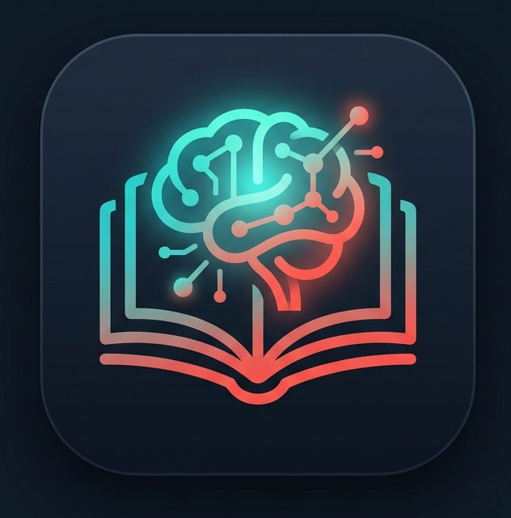

# 📚 LearnSync – AI Study Concierge



**LearnSync** is an intelligent, Agentic AI-powered application designed to act as your personal study concierge. It automatically reads lengthy PDF study materials, extracts core concepts, and generates an active recall multiple-choice quiz with explanations to test your comprehension.

This project is built using a modern **Microservice Architecture** separating the user interface from the AI processing engine.

## 🌟 Key Features
- **Agentic AI Workflow:** Powered by `CrewAI`, the application utilizes a multi-agent system:
  - **The Reader Agent:** Specialized in parsing PDFs and extracting key entities.
  - **The Tutor Agent:** Specialized in pedagogical concepts, generating summaries and active recall quizzes.
- **Bring Your Own Key (BYOK):** Users provide their own Google Gemini API Key directly in the UI. No keys are hardcoded, ensuring zero risk of accidental billing or quota exhaustion for the developer.
- **Security Hardened:** 
  - Strict **15 MB** file upload limit to prevent Denial of Service (DoS) attacks.
  - Anti-prompt injection rules implemented directly within the Agent's backstory.
- **Modern UI/UX:** Built with Streamlit but overhauled with custom CSS for a premium SaaS look, featuring a clean hero section, gradients, and a two-column responsive layout.

---

## 📂 Project Structure

```text
LearnSync/
│
├── backend/                  # The AI Processing Engine (FastAPI)
│   ├── api/
│   │   └── main.py           # FastAPI server & endpoints
│   ├── agents/
│   │   ├── study_crew.py     # CrewAI multi-agent orchestration
│   │   └── tools/
│   │       └── pdf_tool.py   # Custom tool for reading PDF text
│   ├── Dockerfile            # Hugging Face Spaces ready Docker config
│   └── requirements.txt      # Backend dependencies
│
└── frontend/                 # The User Interface (Streamlit)
    ├── assets/               # Images and logos
    ├── app.py                # Streamlit UI layout and logic
    └── requirements.txt      # Frontend dependencies
```

---

## 🚀 How to Run Locally

If you wish to run both the frontend and backend on your local machine, follow these steps:

### 1. Start the Backend (FastAPI)
Open a terminal and navigate to the `backend` folder:
```bash
cd backend
pip install -r requirements.txt
uvicorn api.main:app --reload
```
*The backend will start running on `http://localhost:8000`*

### 2. Start the Frontend (Streamlit)
Open a **new** terminal and navigate to the `frontend` folder:
```bash
cd frontend
pip install -r requirements.txt
streamlit run app.py
```
*Your browser will automatically open the LearnSync UI.*

*(Note: If you have deployed the backend to Hugging Face, ensure the `backend_url` in `frontend/app.py` points to your Hugging Face Space URL).*

---

## 📖 User Guide (How to Use)

1. **Get an API Key:** Obtain a free Gemini API Key from [Google AI Studio](https://aistudio.google.com/).
2. **Configure the App:** Open the LearnSync web app. In the left sidebar, paste your Google API Key into the configuration field. *(Rest assured, this key is only sent directly to the API and is never saved/logged).*
3. **Upload Material:** In the main area, upload your study material in **PDF format** (Maximum size: 15 MB).
4. **Start Learning:** Click the **"Start Learning Process"** button.
5. **Wait for the Magic:** The AI agents will begin reading and analyzing your document. This sequential agentic process takes about **30 to 90 seconds**.
6. **Review & Test:** Once completed, the AI will present a structured summary of the core concepts followed by a 5-question multiple-choice quiz complete with answer explanations. Happy studying!

---
*Created as an advanced AI Portfolio Project.*
