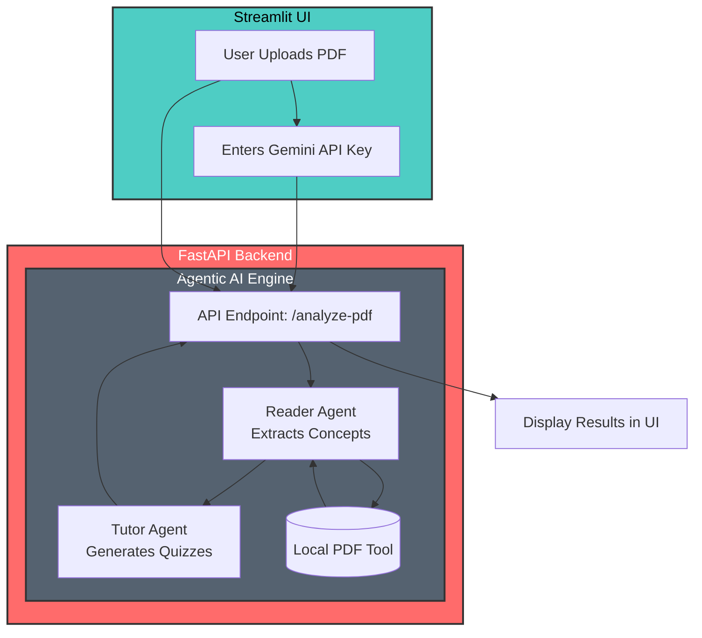

# 📚 LearnSync – AI Study Concierge


## 🚨 Problem Statement
In today's fast-paced academic and professional environment, learners are overwhelmed by massive, text-heavy PDF documents. Traditional studying methods—passively reading hundreds of pages—are inefficient, leading to poor retention and cognitive overload. There is a gap between consuming information and actually verifying comprehension through active recall.

## 💡 The Solution
**LearnSync** is an intelligent, Agentic AI-powered application designed to act as your personal study concierge. It bridges the gap between passive reading and active learning by automatically reading lengthy PDF study materials, extracting core concepts, and generating an active recall multiple-choice quiz with explanations to test your comprehension.

## 🤖 Why Agents?
While a standard Large Language Model (LLM) can summarize text, solving the complex pedagogical workflow requires a **multi-agent system**. LearnSync utilizes `CrewAI` to separate concerns:
- **The Reader Agent** is strictly specialized in document parsing and information extraction. It handles large context windows and ignores complex formatting, acting as the "eyes".
- **The Tutor Agent** is specialized in pedagogy. It takes the structured output from the Reader Agent and focuses entirely on generating high-quality, distractor-rich multiple-choice questions and supportive explanations. 
This agentic workflow prevents hallucination, improves output quality, and ensures that the quiz is firmly rooted in the provided text.

---

## 🏗️ Architecture

This project is built using a modern **Microservice Architecture** separating the user interface from the AI processing engine.



### Key Technical & Security Features
- **Bring Your Own Key (BYOK):** Users provide their own Google Gemini API Key directly in the UI. No keys are hardcoded, ensuring zero risk of accidental billing or quota exhaustion for the developer.
- **Security Hardened:** 
  - Strict **15 MB** file upload limit to prevent Denial of Service (DoS) attacks.
  - Anti-prompt injection rules implemented directly within the Agent's backstory.
- **Modern UI/UX:** Built with Streamlit but overhauled with custom CSS for a premium SaaS look, featuring a clean hero section, gradients, and a two-column responsive layout.

---

## 🚀 The Build Journey (Writeup)

Building LearnSync was an iterative process focused on balancing AI capabilities with user experience and security.

1. **Initial Conception:** The idea was born out of frustration with long lecture notes. Initially, a single prompt was used to generate quizzes, but it often hallucinated answers or missed the core concepts from the text.
2. **Transition to Agents:** To solve the hallucination issue, the architecture was migrated to **CrewAI**. By splitting the task into a *Reader* (extraction) and a *Tutor* (pedagogy), the quality of the quizzes skyrocketed.
3. **Security First:** A major hurdle was handling API costs and potential abuse. The **BYOK (Bring Your Own Key)** model was implemented, shifting the API cost to the user while keeping the platform free to host. 
4. **Tool Integration:** A custom `pdf_tool` was built using PyPDF2 to allow the Reader Agent to natively digest local files without relying on external, potentially insecure third-party PDF reading APIs.
5. **UI Polish:** Finally, standard Streamlit elements were hidden and overridden with custom CSS to give LearnSync the polished, modern feel of a premium SaaS product.

---

## 📂 Project Structure

```text
LearnSync/
│
├── backend/                  # The AI Processing Engine (FastAPI)
│   ├── api/
│   │   └── main.py           # FastAPI server & endpoints
│   ├── agents/
│   │   ├── study_crew.py     # CrewAI multi-agent orchestration
│   │   └── tools/
│   │       └── pdf_tool.py   # Custom tool for reading PDF text
│   ├── Dockerfile            # Hugging Face Spaces ready Docker config
│   └── requirements.txt      # Backend dependencies
│
└── frontend/                 # The User Interface (Streamlit)
    ├── assets/               # Images and logos
    ├── app.py                # Streamlit UI layout and logic
    └── requirements.txt      # Frontend dependencies
```

---

## 🚀 How to Run

By default, the backend is **already deployed** in the cloud. You only need to run the frontend to use the application.

### 1. Run the Frontend (Streamlit)
Open a terminal and navigate to the `frontend` folder:
```bash
cd frontend
pip install -r requirements.txt
streamlit run app.py
```
*Your browser will automatically open the LearnSync UI. It will connect to the live backend automatically.*

### 2. (Optional) Run the Backend Locally
If you want to modify the backend or run it locally instead of using the deployed version:
Open a **new** terminal and navigate to the `backend` folder:
```bash
cd backend
pip install -r requirements.txt
uvicorn api.main:app --reload
```
*The backend will start running on `http://localhost:8000`*

*(Note: If you run the backend locally, you must tell the frontend to use it by setting the environment variable before running the frontend: `export BACKEND_URL=http://localhost:8000` (on Linux/Mac) or `set BACKEND_URL=http://localhost:8000` (on Windows). Otherwise, the frontend will connect to the deployed cloud version by default).*

---

## 📖 User Guide (How to Use)

1. **Get an API Key:** Obtain a free Gemini API Key from [Google AI Studio](https://aistudio.google.com/).
2. **Configure the App:** Open the LearnSync web app. In the left sidebar, paste your Google API Key into the configuration field and select your preferred AI Model (e.g., Gemini 2.5 Flash, Gemini 1.5 Pro). *(Rest assured, this key is only sent directly to the API and is never saved/logged).*
3. **Upload Material:** In the main area, upload your study material in **PDF format** (Maximum size: 15 MB).
4. **Start Learning:** Click the **"Start Learning Process"** button.
5. **Wait for the Magic:** The AI agents will begin reading and analyzing your document. This sequential agentic process takes about **30 to 90 seconds**.
6. **Review & Test:** Once completed, the AI will present a structured summary of the core concepts followed by a 5-question multiple-choice quiz complete with answer explanations. Happy studying!

---
*Created for the Hackathon Submission.*
